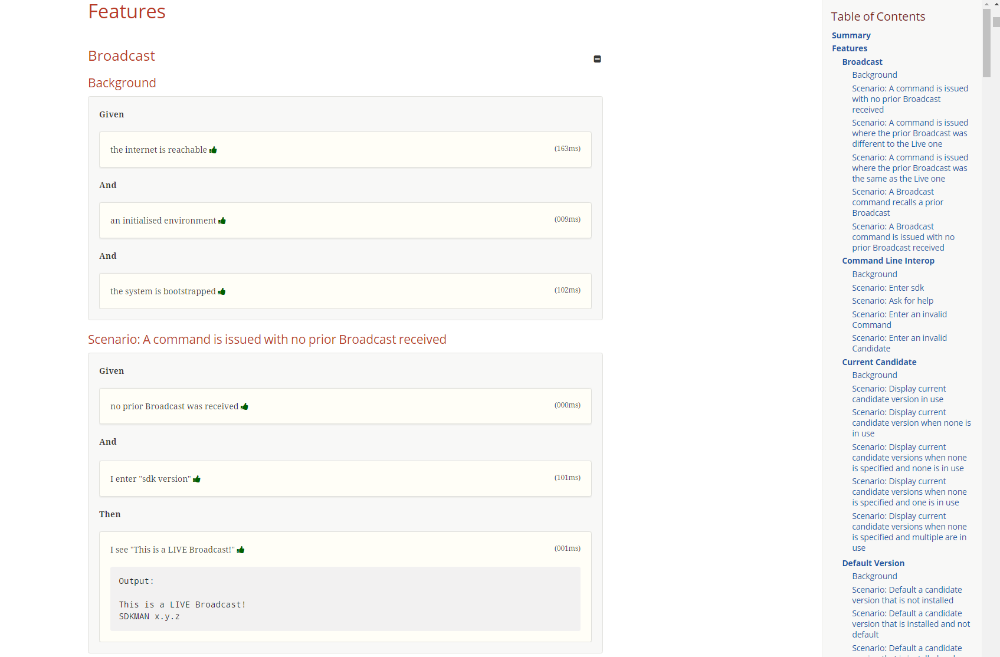
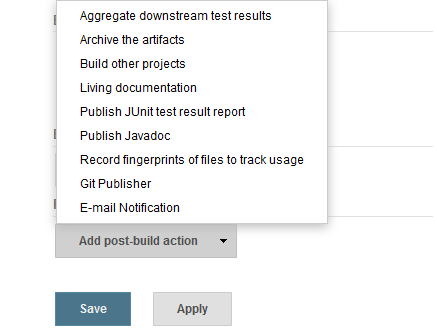
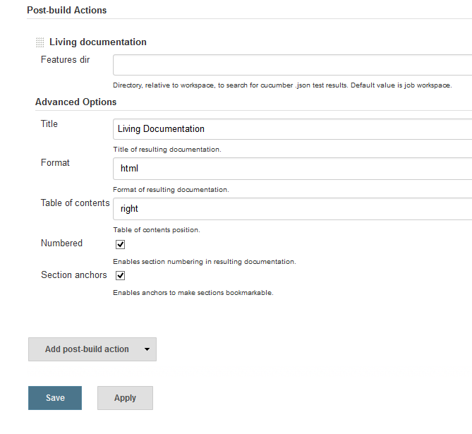
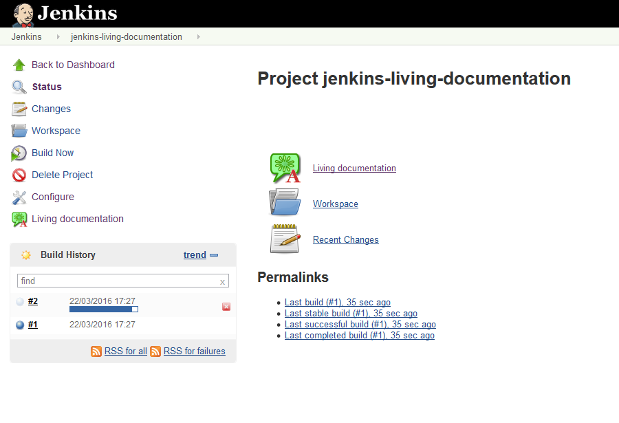
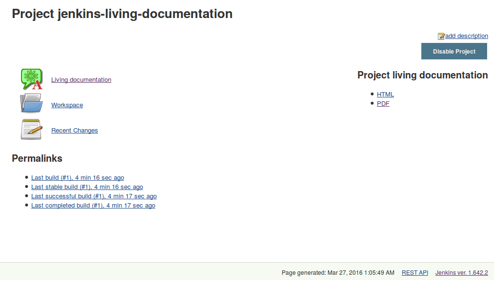
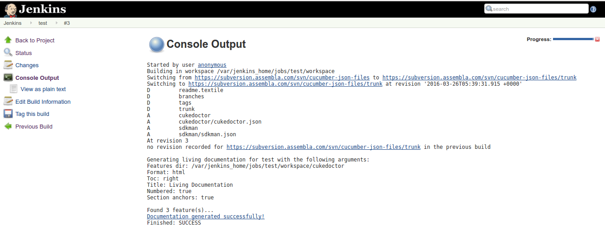

= Cucumber Living Documentation Plugin for Jenkins
:toc: preamble
:sectanchors:
:sectlink:
:numbered:

image:https://travis-ci.org/jenkinsci/cucumber-living-documentation-plugin.svg[Build Status (Travis CI), link=https://travis-ci.org/jenkinsci/cucumber-living-documentation-plugin]
image:https://coveralls.io/repos/jenkinsci/cucumber-living-documentation-plugin/badge.svg?branch=master&service=github[Coverage, link=https://coveralls.io/r/jenkinsci/cucumber-living-documentation-plugin]

BDD living documentation on your jenkins build via https://github.com/rmpestano/cukedoctor[Cukedoctor^].

== Introduction

The Cucumber living documentation plugin basically scans for Cucumber json output files in jenkins workspace in order to generate living documentation from it.

Cucumber json output files are generated after Cucumber test using the json formatter:

[source,java]
----
@RunWith(Cucumber.class)
@CucumberOptions(plugin = {"json:target/cucumber.json"} )
----
NOTE: *plugin* option replaced *format* option which was deprecated in newer cucumber versions.

Here is how a Cucumber feature look like in a documentation:

The feature file for sample above can be https://github.com/rmpestano/dbunit-rules/blob/master/cdi/src/test/resources/features/core/core-seed-database.feature[found here^].
 
TIP: For more example documentations http://rmpestano.github.io/cukedoctor/[see here^].

== Usage
After instalation the post build action *Living documentation* must be available on your jobs:

== Configuration

Here are the possible plugin configuration:

== Accessing documentation

When Cucumber living documentation plugin is enabled in your job it adds a link which will take you to current project documentation:

NOTE: The plugin only stores the last generated documentation. 

If you choice format *all* in configuration then two links will be rendered in the side panel:

 
[IMPORTANT]
====
If you face the exception below:
----
java.lang.ClassCircularityError: org/jruby/RubyClass
----

you probably hit https://issues.jenkins-ci.org/browse/JENKINS-31019[issue JENKINS-31019], to solve that you need to upgrade your installation to *v1.640* or newer.
====

== Jenkins pipeline step

Following is an example of pipeline step using this plugin:

----
node {
    checkout([$class: 'SubversionSCM', additionalCredentials: [], excludedCommitMessages: '', excludedRegions: '', excludedRevprop: '', excludedUsers: '', filterChangelog: false, ignoreDirPropChanges: false, includedRegions: '', locations: [[credentialsId: '', depthOption: 'infinity', ignoreExternalsOption: true, local: '.', remote: 'https://subversion.assembla.com/svn/cucumber-json-files/trunk']], workspaceUpdater: [$class: 'UpdateUpdater']])
    step([$class: 'CukedoctorPublisher', featuresDir: '', format: 'HTML', hideFeaturesSection: false, hideScenarioKeyword: false, hideStepTime: false, hideSummary: false, hideTags: false, numbered: true, sectAnchors: true, title: 'Living Documentation', toc: 'RIGHT'])
}
----

Since version _1.0.10_ it is possible to use the *livingDocs* shortcut in pipeline DSL:

----
node {
    svn 'https://subversion.assembla.com/svn/cucumber-json-files/trunk'
    livingDocs()
}
----

Parameters should be declared as `key`: `'value'` as example below:

----
node {
    svn 'https://subversion.assembla.com/svn/cucumber-json-files/trunk'
    livingDocs(featuresDir:'cukedoctor')
}
----

Or using the https://jenkins.io/doc/book/pipeline/syntax/[declarative pipeline^]:

----
pipeline {
    agent any
    stages {
        stage('Checkout') {
            steps {
                svn 'https://subversion.assembla.com/svn/cucumber-json-files/trunk'
                livingDocs(featuresDir:'cukedoctor')
            }
        }
    }
}
----

== Docker

An easy way to test this plugin is using a docker container, here are the steps (assumming you have docker installed):

. Run the image:
+
----
docker run -it -p 8080:8080 rmpestano/jenkins-living-documentation
----
+
. Access localhot:8080/ and create a job
. Configure this svn repository: https://subversion.assembla.com/svn/cucumber-json-files/trunk/ 
+
NOTE: This repository contains cucumber json sample files for the living documentation plugin 
. Add the *Living documentation* _post build action_;
. Just run the job

TIP: use featuresDir to point to specific json output, eg: /cukedoctor.

Job output should look like:

